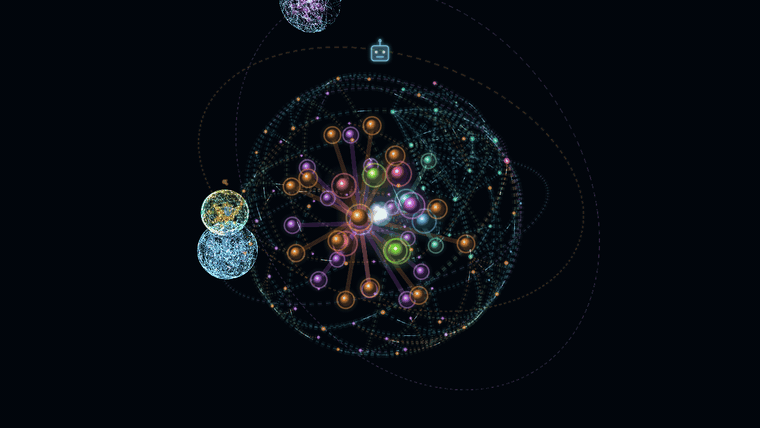
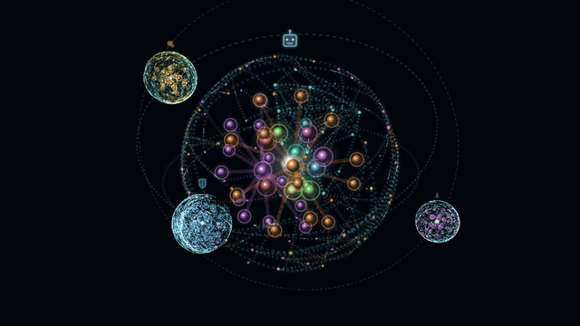
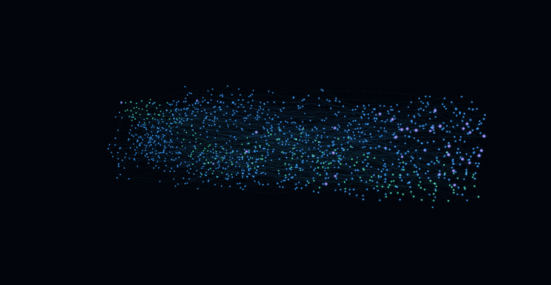
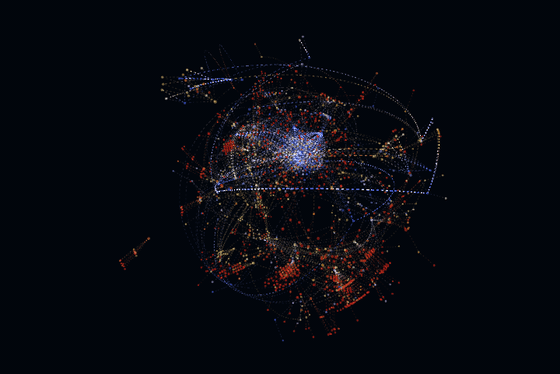
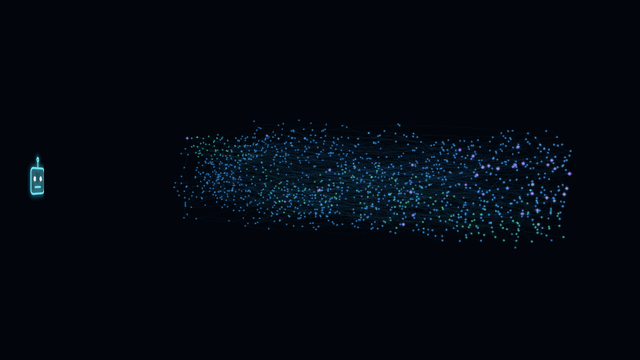
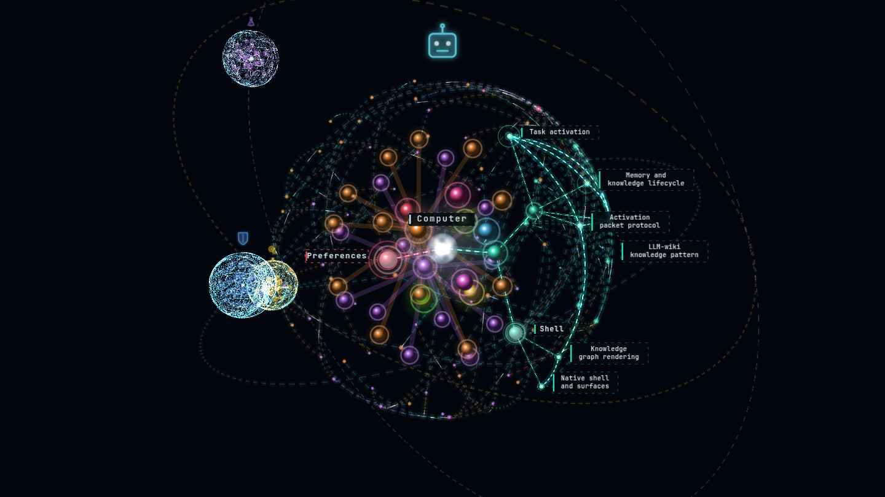
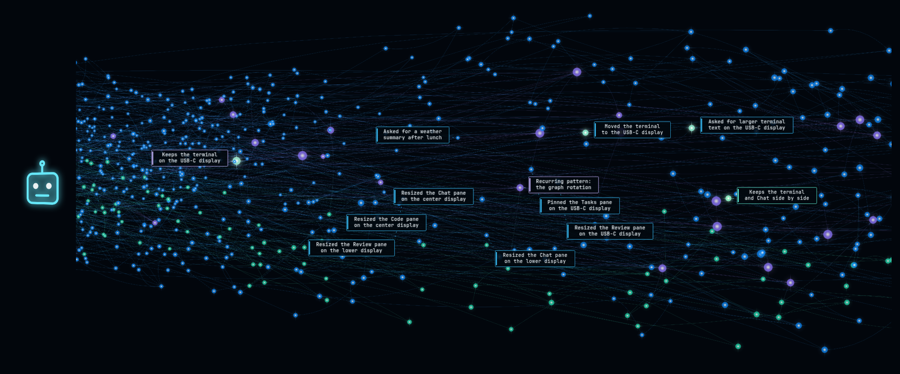

<div align="center">

# Obsidience

**A graph-native, local-first agent harness and Linux desktop shell.**



</div>

Obsidience runs an Executive Agent on your own machine and gives it a maintained
Markdown wiki instead of a pile of prompts. Every Article is a node in one
knowledge graph. Agents, Tasks, Runbooks, Skills and Tools are Articles too,
and explicit dependencies, never similarity, decide what an Agent may run.
Chat and speech enter the same native Executive loop, specialist Agents curate,
research and verify, Hindsight keeps per-Agent memory, and a Hyprland +
Quickshell shell puts it all on the desktop as live 3D graphs that show exactly
which Articles and memories the Agents were given.

## What you're looking at

These clips are recorded from the real graph UI (the same React/Three.js bundle
the shell runs), fed from this repository: the public starter Vault, the code
index of this repository, and a set of invented demo memories. The rotating
clips are time-lapsed; the graphs turn slowly on the desktop.

The banner above is the Executive's knowledge graph: the Agent at the center,
its subjects and Articles on shells around it, hierarchy beams in each
branch's color, and links between Articles as fainter tendrils. Darwin,
Alexandria and Heimdall orbit it as their own smaller graphs.

<table>
<tr>
<td width="50%" valign="top">

<p><b>Thinking.</b> When the Executive answers, the Articles in its context
packet light up. Beams travel down the hierarchy to each supplied Article,
comets run between linked Articles in the same packet, the activity card lists
the turn's operations (here a Hindsight recall), and the central orb follows
the spoken reply's waveform.</p>
</td>
<td width="50%" valign="top">

<p><b>Recall.</b> A Hindsight <code>Memories recalled</code> result lights
the exact returned memories in the Agent's memory bank, the timeline lens
opens around them, and their labels appear. Nothing glows that the provider
did not return.</p>
</td>
</tr>
<tr>
<td width="50%" valign="top">

<p><b>Code.</b> This repository as indexed by
<a href="https://github.com/DeusData/codebase-memory-mcp">codebase-memory-mcp</a>,
laid out with the knowledge graph's spherical solver: folders, files,
classes and functions, with calls and imports as cross-links. Saved files and
coding-agent lookups light the exact files and symbols involved.</p>
</td>
<td width="50%" valign="top">

<p><b>Memory.</b> An Agent's Hindsight bank as a timeline tube. Memories run
oldest to newest along it, spaced by activity; color marks world facts,
experiences and consolidated observations, and native Hindsight links hold
the coil together. The desktop stage stacks one tube per Agent beside its
role icon.</p>
</td>
</tr>
</table>

<table>
<tr>
<td width="50%"></td>
<td width="50%"></td>
</tr>
</table>

## Highlights

- **Executive voice and chat.** Typed Chat and final speech transcripts enter
  one native DeepSeek Harness session for the Executive. Its identity Article
  owns its instructions and its direct Skill catalog; there is no router or
  preliminary model call. Realtime speech uses Pipecat transport, NeMo/Nemotron
  streaming recognition and Pocket TTS, and partial speech can prepare a
  cancellable prompt prefix.
- **A knowledge graph you review.** Knowledge follows the
  [LLM-wiki pattern](https://gist.github.com/karpathy/442a6bf555914893e9891c11519de94f):
  immutable Sources, an agent-maintained Markdown wiki and its schema are plain
  files. Agents stage proposals; accepted changes land through Review and a
  local Git audit trail, then flow into retrieval and the graph.
- **Specialist Agents.** Darwin researches and hands off cited Sources,
  Alexandria curates and links Articles, Heimdall checks evidence and performs
  receipt-safe recovery. They orbit the Executive in the graph.
- **Hindsight memory.** Optional per-Agent memory banks hold facts, experiences
  and consolidated observations with original dates. Recall is bounded, and
  memory stays separate from accepted knowledge.
- **Code graph.** An optional view over codebase-memory-mcp's index of a
  repository, with a Follow mode that zooms into a saved file and unfolds its
  symbols.
- **A real desktop shell.** Hyprland owns composition and input; one Quickshell
  host serves panes (Chat, Reader, Tasks, Reviews, Terminal, Settings and more)
  across Surfaces, and a QtWebEngine stage renders the graphs.
- **Explicit ownership.** Integration follows Cordis-style composition:
  explicit service contracts, declared dependencies, cleanup paired with
  acquisition and one owner per store, conversation, scheduler and model
  reservation. Tool arguments, Review, receipts and completion acceptance stay
  in code, and knowledge links never grant a capability.

## Quick start

This repository distributes a reviewed starter graph in
[`obsidience/defaults/vault/`](obsidience/defaults/vault/), separate from the live
Vault. It includes the Executive, Alexandria, Darwin and Heimdall; their reusable
capability library, project architecture and ordinary knowledge subjects. It
contains no previous owner's computer inventory or personal knowledge.

From the repository root, prepare the Python and native Executive dependencies:

```sh
python -m venv .venv
.venv/bin/python -m pip install -r obsidience/harness/requirements.txt -c obsidience/harness/requirements.lock.txt
.venv/bin/python -m pip install --no-deps -r obsidience/harness/execution/deepseek/requirements-optimization.txt
npm --prefix obsidience/harness/execution/deepseek ci --ignore-scripts --no-audit --no-fund
./obsidience/scripts/obsidience init
```

Initialization installs the graph once and creates a local Vault Git audit trail
with no remote. It refuses to overwrite any existing Vault. Application updates
never replace live Articles or synchronize local knowledge into shared defaults.
See [installation knowledge](obsidience/defaults/README.md) for the publication
and update workflow.

The live `obsidience/vault/`, `obsidience/evidence/`, and `obsidience/state/` trees
are ignored by the application repository. This includes conversations, local
preferences, Sources and Inbox, archives and proposals, runtime databases,
model assignments and device state. Article approvals commit only
inside the separate local Vault repository.

### Configure this installation

Create an ignored `obsidience/obsidience.toml` from
[`obsidience.example.toml`](obsidience/obsidience.example.toml). Review the
model catalog (`obsidience/harness/models/runtime.py`), model storage and hardware
selections for this machine before running inference. Default Agent and Task Articles select `auto`; the
repository supplies no model weights or saved device assignments.

```toml
llm_model = "obsidience-gemma"
```

This is a development project, not a universal desktop installer. Native shell,
session, application launch and model scripts include Linux integration profiles
that must be reviewed and configured for the target host. Do not apply another
installation's monitor, storage or service settings blindly. Machine-specific
operating instructions belong in the ignored `AGENTS.local.md`.

Durable Auto-curate and periodic schedules are not inherited from the development
machine. Historical observations belong to the optional Hindsight provider.
The optional voice/session unlock capability is documented in the library but
is not granted by the starter Executive; enabling it is a local owner's choice.
The Memory and Code views need their optional providers; see
[graph adapters](obsidience/harness/graphs/README.md) for setup and limits.

### Run and develop

```sh
./obsidience/scripts/obsidience status
./obsidience/scripts/obsidience serve
./obsidience/scripts/obsidience index
pnpm --dir obsidience/ui install --frozen-lockfile
pnpm --dir obsidience/ui typecheck
pnpm --dir obsidience/ui build
```

The API defaults to loopback port 8765. The native UI is started by the configured
desktop session. Backend
changes require only the Harness reload; graph changes require rebuilding and
reloading the graph presenter. Preserve the secure locker and compositor.
Instruction-only changes need no restart.

Validate the affected behavior directly. Preserve existing tests, use a narrow
existing check when needed, and do not add tests or run broad suites unless asked.

## How it works

```text
Chat / speech → Executive identity + context → DeepSeek model / Tool loop
Specialist work → Task → Runbook → Skill → Tool
Explicit research / Source intake → immutable Source → Darwin → Inbox → Alexandria
Accepted Article changes → Review / local audit → graph + retrieval
```

- The Executive answers and operates through its explicit direct Skill catalog.
- Darwin researches and produces bounded, cited Source handoffs.
- Alexandria curates and links maintained knowledge through the existing writers.
- Heimdall independently checks evidence and performs receipt-safe recovery.

Knowledge links never grant a capability. Tool arguments, exact targets,
observation leases, cancellation, Review, receipts and completion acceptance
remain code-owned. Uncertain effects are not replayed. The thinking animation
shows the actual supplied context and remains lit through speech; the central
orb follows the output waveform.

The Harness owns conversation, knowledge, model resources, capability validation,
Review and execution receipts. Hyprland owns composition and desktop input;
Quickshell presents native controls and panes, and a QtWebEngine presenter displays
the shared React/Three.js knowledge graph.

## Documentation

- [DESIGN.md](DESIGN.md): the ontology, design laws and execution rules.
- [Shell](obsidience/shell/README.md): native desktop setup, panes and Surfaces.
- [Graph adapters](obsidience/harness/graphs/README.md): the Memory and Code
  views, their providers and limits.
- [Installation knowledge](obsidience/defaults/README.md): the starter Vault and
  how defaults are published.

## Project layout

| Path | Responsibility |
| --- | --- |
| `obsidience/harness/` | API, CLI, conversation, execution, capabilities, models, knowledge and speech |
| `obsidience/shell/` | Native desktop/session adapters, panes and graph presenter |
| `obsidience/ui/` | Shared React/Three.js graph and interface bundle |
| `obsidience/defaults/vault/` | Reviewed, distributable starter Articles |
| `obsidience/vault/` | Ignored live Articles and local audit repository |
| `obsidience/evidence/` | Ignored immutable Sources, Inbox and evidence |
| `obsidience/state/` | Ignored SQLite, settings and runtime artifacts |
| `obsidience/scripts/` | Development and runtime entry points |
| `obsidience/tests/` | Existing behavior and architecture checks |
| `docs/media/` | README screenshots and animations |

Previously published Git history is distinct from the current installation
snapshot. Removing live files from a new commit does not remove them from older
commits, branches, forks or existing clones.
